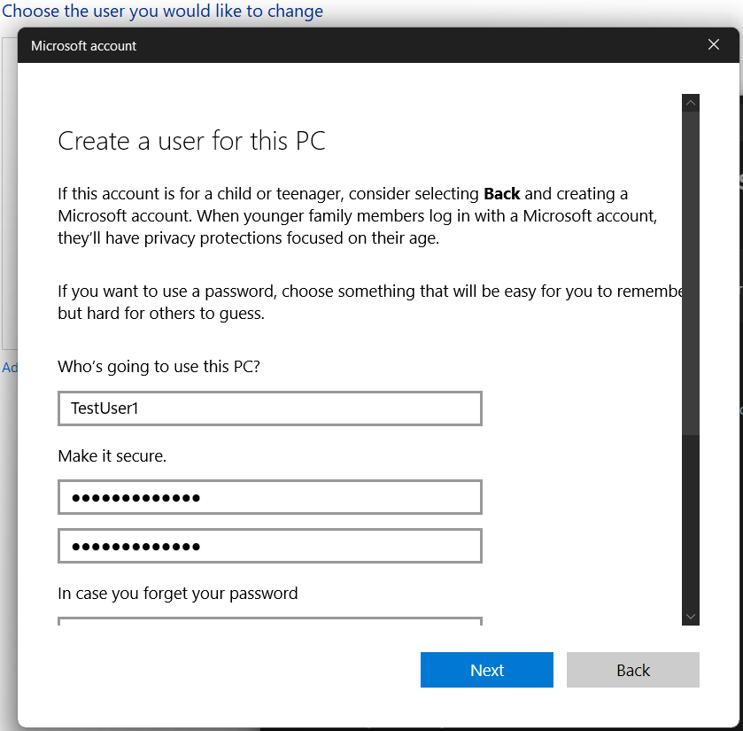
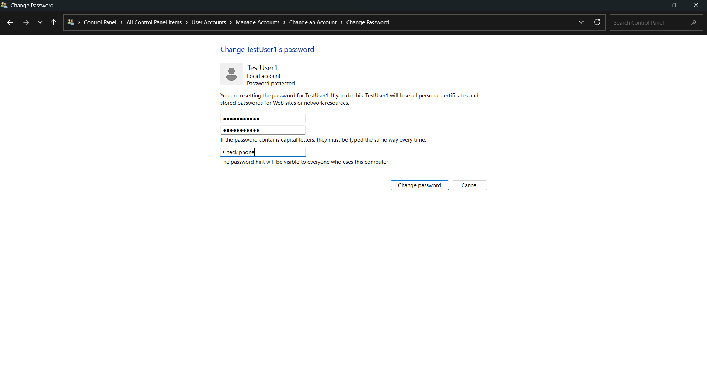
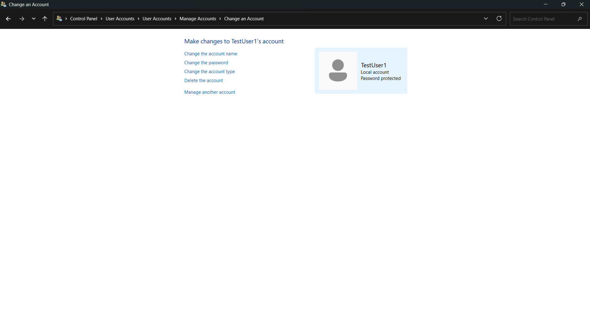
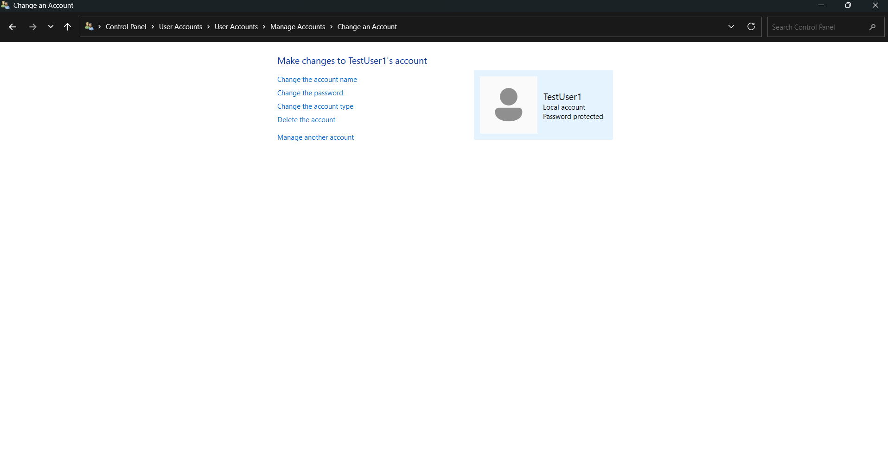

# local-account-password-reset
Demonstration of IT support workflow for local account password reset on Windows.
# Local Account Password Reset (Windows)

This project demonstrates a common IT support workflow: resetting a local account password in Windows.  
It documents each step with screenshots to show the process clearly.

---

## Workflow Steps

### Step 1: Create a Test Account

### Step 2: Simulate Forgotten Password

### Step 3: Reset the Password

### Step 4: Force Password Change at Next Login (Simulated)

### Step 5: Unlock Account (Optional)

---

## Reflection

Password resets are one of the most frequent IT support requests.  
This exercise demonstrates my ability to:
- Document workflows step‑by‑step with clarity.  
- Apply security best practices (forced password change, account unlock).   
